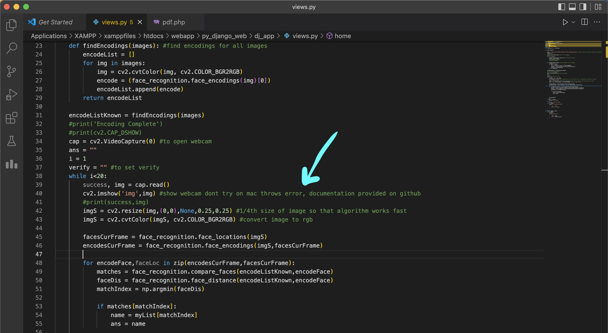
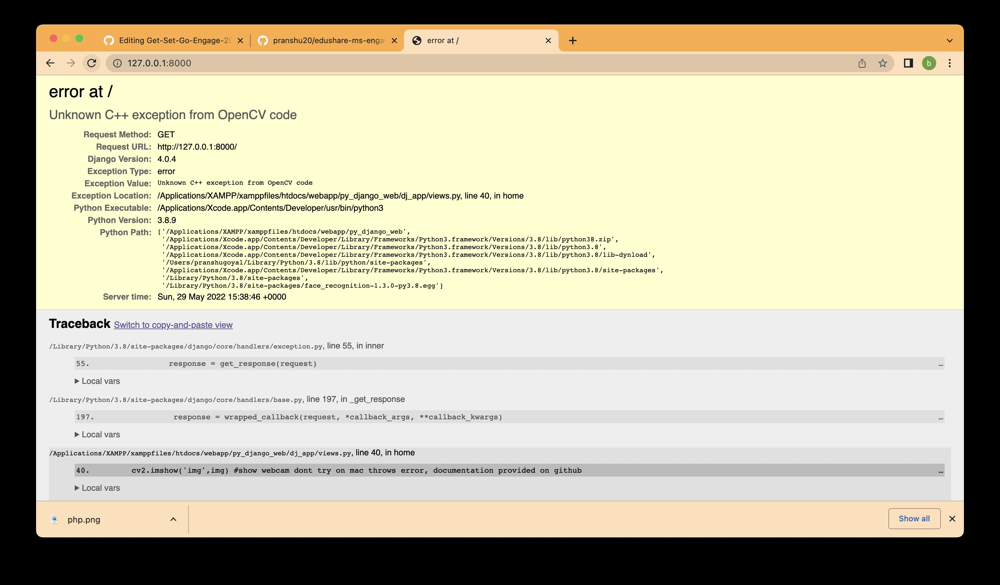
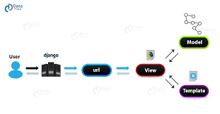
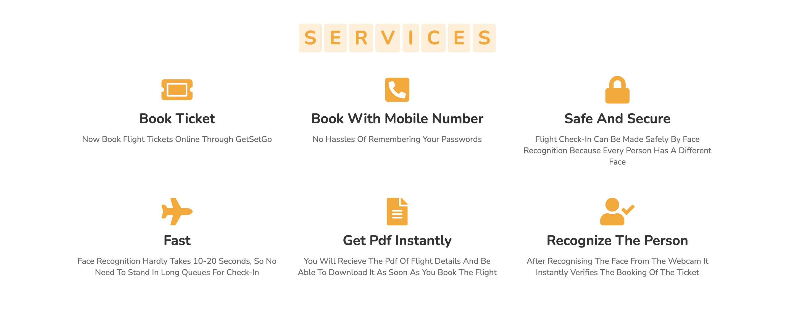
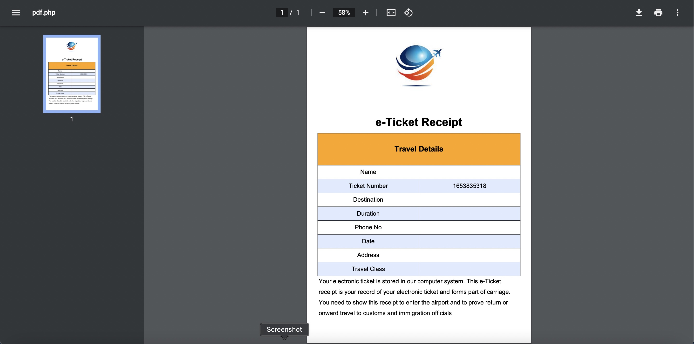
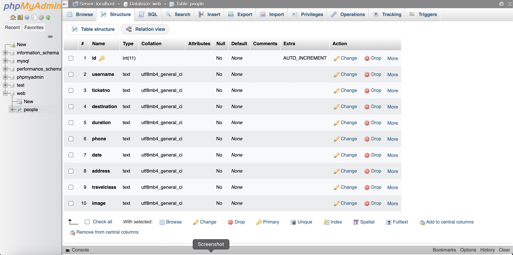

# Get-Set-Go

One stop application to book your flight ticket, Verify face and check-in at the airport by face recognition technology implemented using open-cv python which is safe and secured.

See the video demo here: 

#### GetSetGo Features:

- Book flight tickets online
- Book with mobile number so no hassles of remembering the passwords
- Verifying the face hardly takes 10-20 seconds so no need to stand in long queues to check in at the airport
- Recieve the pdf of booking details instantly as soon as you book and download it

## Tech Stack [MAMP/WAMP]

#### Frontend

- Frontend Language: `HTML`
- Frontend Framework: `Django`
- Styling: `CSS`

#### Backend

- Server: `Apache(xampp)`
- Database: `MySQL`
- Face Recognition Library: `OpenCV`
- Backend Language: `PHP`
- Backend Framework: `Django`

## Application Setup Guidelines

1. Clone the project

   ```
   git clone https://github.com/pranshu20/Get-Set-Go-Engage-2022
   ```

2. Install xampp

3. Install opencv-python , dlib, face_recognition

   ```
   pip3 install opencv-python
   pip3 install cmake
   pip3 install dlib
   pip3 install face_recognition
   ```
4. Place the code of my github repository in xampp/ htdocs/ webapp/ 
  
5. Go to py_django_web(a folder in my code) and copy the path of manage.py

6. Paste it in terminal with cd
   ```
   cd /Applications/XAMPP/xamppfiles/htdocs/webapp/py_django_web
   ```
7. Type 
   ```
   python3 manage.py runserver
   ```
8. You are good to go :)

(if recognize_face button not working then create a virtual environment with django)


## Problem in Macbook

#### Dont try this on macbook unless you remove the below line of code

#### Showing in code

Removing above line will open the webcam but will not show it but the application will run fine. I have tried everything written on the internet about this issue for 2 days and found out that this command runs only on terminal in mac and is default error in open cv not able to show webcam on mac on webpage

#### Showing on webpage


#### Link on Stack-Overflow
https://stackoverflow.com/questions/72380678/opencv-error-cv2-error-unknown-c-exception-from-opencv-code

## Architecture

#### PHP with MySQL database


#### Django


#### PHP


## Screenshots

#### Home


#### Services



#### Booking Form


#### Pdf



#### Verification Page


#### My SQL database



## Developer

https://www.linkedin.com/in/pranshu-goyal-390542198/
